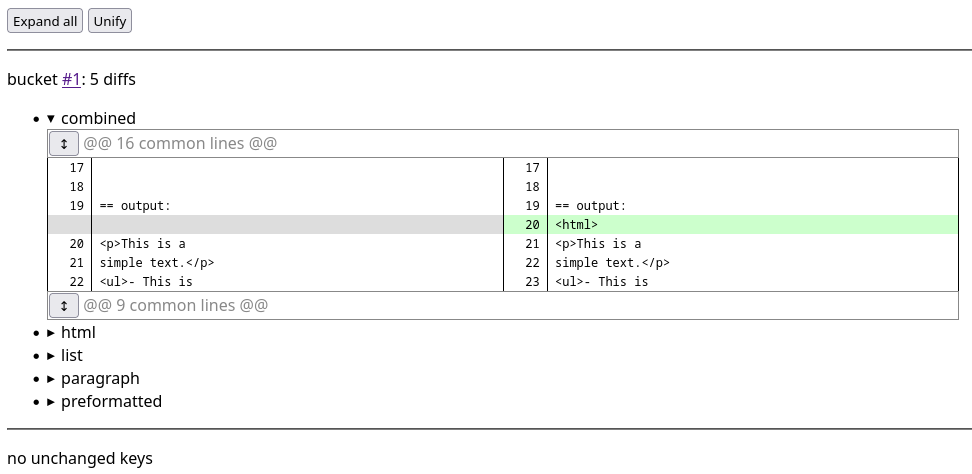

# Markdown example for effdump

This example will demonstrate how to use effdump through a barebones markdown to html converter.
For simplicity's case it keeps all functions in markdowndump.go.
In a more realistic scenario the `Markdown` function would be in a separate package and the effdumping package would import that.

## Define the test cases

Let's develop this in the TDD fashion.
Create a the test inputs first.
Keep them in one file, use https://github.com/ypsu/textar format for convenience:

```
== paragraph
This is a
simple text.

== list
- This is
- a
- list
  with multiple
- entries.

== preformatted
  this is
  a
  preformatted
  block.

== combined
This is a
simple text.

- This is
- two

- lists
  with multiple
- entries.

  this is
  two

  preformatted
  blocks.

== html
this paragraph
contains <script src=foo.js></script> html hacks.

```

Load the testdata into the source code like this:

```
//go:embed markdowndump.textar
var testdata string
```

## Create the effdump

The main markdown converter function will be called `Markdown`.
Create a placeholder, empty function:

```
func Markdown(s string) string {
	return s
}
```

Parse the testcases and call Markdown on them:

```
func makedump() *effdump.Dump {
	dump := effdump.New("markdowndump")
	testentries := strings.Split(testdata[3:], "\n== ")
	for _, entry := range testentries {
		key, value, _ := strings.Cut(entry, "\n")
		dump.Add(key, fmt.Sprintf("== input:\n%s\n\n== output:\n%s\n", value, Markdown(value)))
	}
	return dump
}
```

Two notes:

- To avoid dependencies this code does the test splitting on its own.
  https://github.com/ypsu/textar can be used in a more realistic scenario.
- The dump values repeat the input string.
  Seeing both the input and the corresponding output in one places makes the reviews simpler.

And finally have effdump manage the dump:

```
func main() {
	makedump().Run(context.Background())
}
```

The effdump can now be interacted with:

```
$ go run github.com/ypsu/effdump/example-markdown print paragraph
=== paragraph
        == input:
        This is a
        simple text.


        == output:
        This is a
        simple text.

```

## Make a change

Once all the above is done, `git commit` the files.
Then run `go run github.com/ypsu/effdump/example-markdown save` to save the current state of the file.
The next `go run github.com/ypsu/effdump/example-markdown diff` will be diffing against this last commit's saved state.

Implement skeleton for a basic paragraph based markdown parser:

```
func Markdown(md string) string {
	sb := &strings.Builder{}
	sb.WriteString("<html>\n")
	for _, para := range strings.Split(md, "\n\n") {
		para = strings.TrimRight(para, " \t\n")
		if para == "" {
			continue
		}
		switch para[0] {
		case '-':
			fmt.Fprintf(sb, "<ul>%s</ul>\n", para)
		case ' ', '\t':
			fmt.Fprintf(sb, "<pre>%s</pre>\n", para)
		default:
			fmt.Fprintf(sb, "<p>%s</p>\n", para)
		}
	}
	return sb.String()
}
```

Inspect the diff with the diff subcommand:

```
$ go run github.com/ypsu/effdump/example-markdown diff paragraph
=== paragraph (changed, bucket 1)
         == input:
         This is a
         simple text.


         == output:
        -This is a
        -simple text.
        +<p>This is a
        +simple text.</p>
```

The subcommand accepts a list of globs to print.
The above sample asked it to print the diff of the `paragraph` key.

Let's make sure the output is HTML.
Add this to the Markdown function:

```
	sb.WriteString("<html>\n")
```

Now print the diff for all keys by omitting subarguments to diff:

```
$ go run github.com/ypsu/effdump/example-markdown diff
=== combined (changed, bucket 1)
        @@ 16 common lines @@


         == output:
        +<html>
         <p>This is a
         simple text.</p>
         <ul>- This is
        @@ 9 common lines @@

=== (omitted 4 similar diffs in bucket 1)
        html
        list
        paragraph
        preformatted
```

effdump noticed the diff is same in all keys so it omitted the diffs for them.

Run `go run github.com/ypsu/effdump/example-markdown webdiff` to see a HTML rendition of this diff.
It should look like this:



## Subcommands

Check out `go run github.com/ypsu/effdump/example-markdown help` to see all the functionality effdump provides.
On linux it supports the flag `-watch`.
When that is specified, it reruns the command every time a file changes.
`go run github.com/ypsu/effdump/example-markdown/markdowndump -watch diff` shows continuously up to date diffs.
Very convenient!

Another relevant subcommand would be `go run github.com/ypsu/effdump/example-markdown -subkey=output: webprintraw list`.
`webprintraw` makes effdump serve a value's content directly.
Ideal for cases where the output is HTML.
Furthermore effdump natively supports textar values and can select a specific subkey from it for printing and diffing.
That's what the `subkey` flag does in this case.
So for the above command the output looks like this:


Uh-oh, that looks wrong, let's fix the HTML generated for lists.

## Git hooks

Let's make things even more convenient before doing that.
Add a git post-commit hook containing this:

```
#!/bin/bash
# Install command: ln -s post-commit .git/hooks/
go run github.com/ypsu/effdump/example-markdown save
```

This runs save after each each commit so we don't have to remember doing that after each change.
Saves a lot of hassle.

Similarly, make a precommit like this:

```
#!/bin/bash
# Install command: ln -s pre-commit .git/hooks/
echo -n 'hashing...'
wanthash=$(cat markdowndump.hash)
gothash=$(go run github.com/ypsu/effdump/example-markdown hash)
echo -en "\r\e[K"
if test "$gothash" != "$wanthash"; then
  echo "Error got hash $gothash, want $wanthash."
  echo "$gothash" >markdowndump.hash
  echo "Expectation auto-updated, check 'go run github.com/ypsu/effdump/example-markdown diff' and rerun git commit."
  exit 1
fi
```

This saves the hash of the generated effdump into a git tracked file.
The advantage of this is that every time the generated HTML changes, this hash will change too.
So it will remind the user to check the diffs.
The hash file is automatically updated thanks to the pre-commit so it should not be too annoying.
The only inconvenience is that `git commit` must be run two times after each change in the `Markdown` function or after updating the test inputs.

This is basically golden testing but without needing to submit all generated outputs.
The git repo and git diffs remain lean.

To test this feature, add list support to the Markdown function:

```
			fmt.Fprintf(sb, "<ul>%s</ul>\n", strings.ReplaceAll("\n"+para, "\n- ", "\n<li>"))
```

Verify that it looks OK via `go run github.com/ypsu/effdump/example-markdown -subkey=output: webprintraw list`.
Make sure that the pre-commit and post-commit script is installed.
Now run `git commit -a` and notice that it notices that the hash changed and it autoupdates it.
This would be the reminder to check the effdump diffs.
After that rerun the `git commit -av` and it should succeed.

## Summary

Now try to ensure < and > is properly escaped with `html.EscapeString()`.
Notice how you don't need to touch the tests at all because we added all the relevant tests early on in a TDD fashion.
Just verify that the diffs look as expected.

But beware, golden tests like these are a double-edged sword.
It's very easy to end up with low quality effects which has lot of irrelevant spurious diffs leading to wasted time reviewing them.
Make sure to avoid those and eliminate them if whenever they appear.
